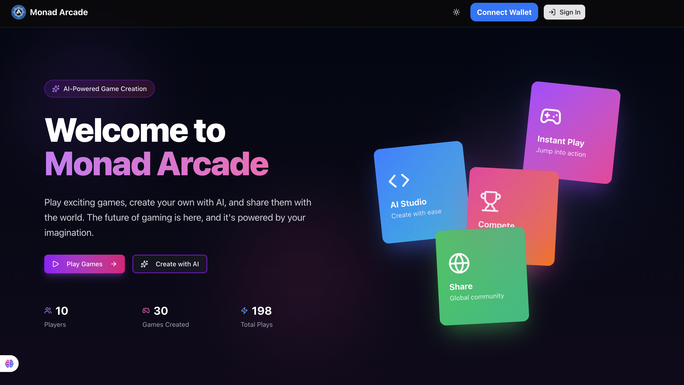
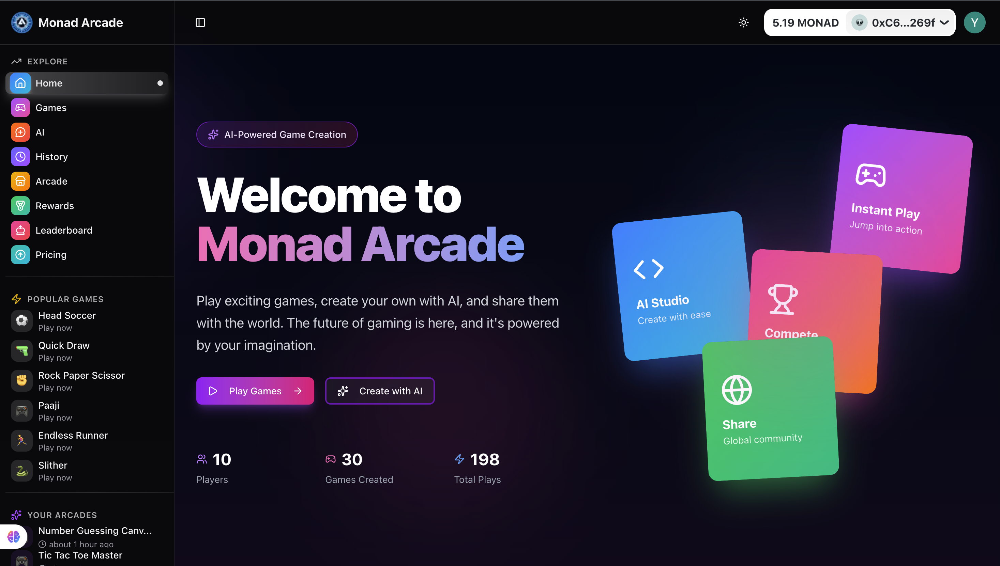
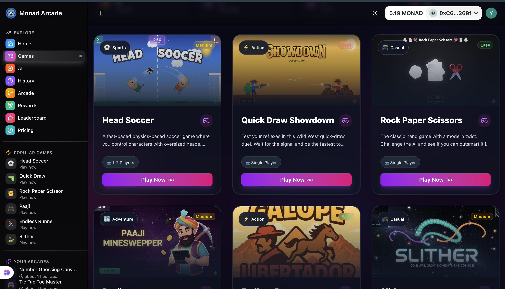
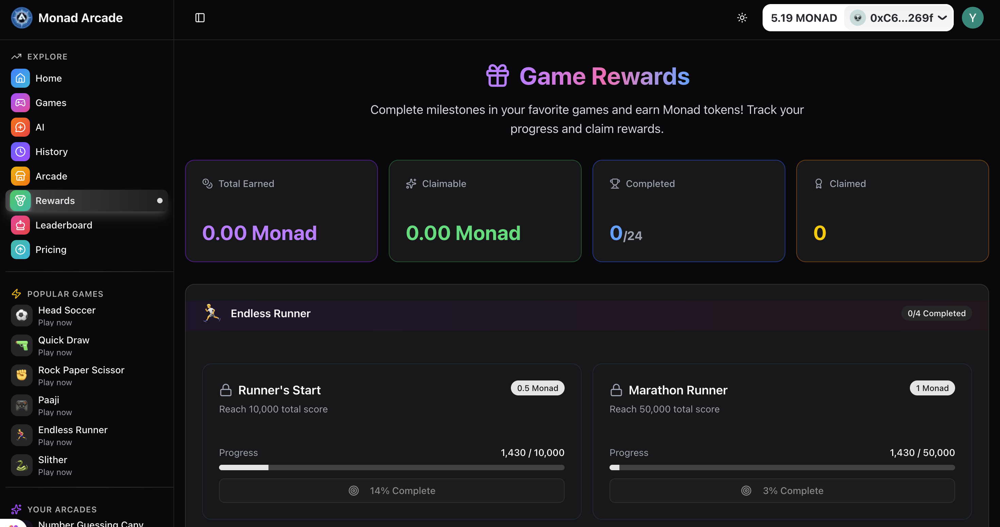
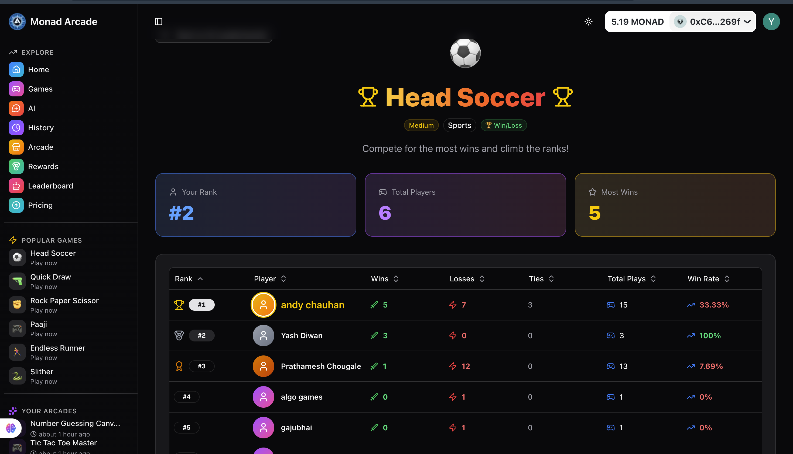

<div align="center">

# 🎮 Monad Arcade

### Stake-to-Earn Gaming Platform

*Stake crypto. Play games. Win 90% of the pool.*

[](https://monad.xyz)
[](LICENSE)
[](https://www.typescriptlang.org/)

[Screenshots](#-screenshots) • [How It Works](#-how-it-works) • [Games](#-games) • [Quick Start](#-quick-start)

</div>

---

## 💡 What is Monad Arcade?

A **stake-to-earn gaming platform** on Monad blockchain where skill meets rewards.

**Simple Concept:** Stake crypto → Play games → Winners take 90% of pool

---

## 🎯 How It Works

<div align="center">

| Step | Action | Example |
|------|--------|---------|
| 1️⃣ Stake | You put in | 1 MONAD |
| 2️⃣ Match | AI puts in | 1 MONAD |
| 3️⃣ Play | Compete | - |
| 4️⃣ Win | You receive | **1.8 MONAD** |
| 💰 Profit | Net gain | **+0.8 MONAD** |

*Platform takes 10% fee (0.2 MONAD)*

</div>

---

## 🎮 Games

### 💰 Stake-to-Earn (Competitive)

| Game | Stake | Win Prize |
|------|-------|-----------|
| 🤝 Rock Paper Scissors | 1 MONAD | 1.8 MONAD |
| 🤠 Quick Draw Showdown | 1 MONAD | 1.8 MONAD |
| ⚽ Head Soccer | 3 MONAD | 5.4 MONAD |

### 🎯 Free-to-Play (Arcade)

🐍 Slither • 🎯 Paaji • 🏃 Endless Runner

---

## 📸 Screenshots

<div align="center">

### Platform Overview


### Games Showcase


### Gameplay Experience


### Platform Features


### Dashboard & Analytics


</div>

---

## ✨ Key Features

- 💰 **90% Winner Payout** - Highest rate in crypto gaming
- ⚡ **Instant Rewards** - Smart contracts auto-distribute
- 🎯 **Skill-Based** - Win by playing better, not luck
- 🔐 **Provably Fair** - All outcomes on-chain
- 📱 **Multi-Platform** - Web + Farcaster
- 🤖 **AI Studio** - Create custom games
- 🏆 **Leaderboards** - Global rankings

---

## 🛠️ Tech Stack

**Frontend:** Next.js 16 • TypeScript • Tailwind CSS  
**Blockchain:** Monad • Ethers.js • Wagmi • Solidity  
**Backend:** MongoDB • oRPC • better-auth  
**AI:** Google Gemini 2.5

---
## ✨ What Makes It Great

### For Investors 💼
- Clear revenue model (10% fee)
- Transparent payout structure
- Professional presentation
- Tech stack credibility

### For Players 🎮
- Easy to understand
- Clear game options
- Prize amounts visible
- Simple onboarding

### For Developers 👨‍💻
- Tech stack listed
- Quick start guide
- Contributing info
- License clear


## 🚀 Quick Start

```bash
# Clone & install
git clone https://github.com/yourusername/monad-arcade.git
cd monad-arcade
bun install

# Configure environment
cp apps/web/.env.example apps/web/.env
# Edit .env with your settings

# Run
bun dev
# Visit http://localhost:3000
```

### Environment Setup

See `.env.example` for required variables:
- MongoDB connection
- Monad RPC & contract addresses
- Authentication credentials
- WalletConnect project ID

---

## 🔐 Security

✅ Smart contracts deployed on Monad  
✅ Transparent prize pools  
✅ Automated payouts  
✅ Provably fair outcomes  

---

## 📈 Roadmap

🎯 Mainnet Launch • 🎮 PvP Multiplayer • 🏆 Tournaments • 🎨 NFT Rewards

---

## 🤝 Contributing

We welcome contributions! Please see our contributing guidelines.

---

## 📄 License

This project is licensed under the MIT License - see the [LICENSE](LICENSE) file for details.

---

## 🔗 Links

- **Website:** [Coming Soon]
- **Twitter:** [Coming Soon]
- **Discord:** [Coming Soon]
- **Documentation:** [See /apps/web/README.md](./apps/web/README.md)

---

## 💬 Support

Need help? 
- 📖 Check the [documentation](./apps/web/README.md)
- 🐛 [Open an issue](https://github.com/yourusername/monad-arcade/issues)
- 💬 Join our Discord [Coming Soon]

---

<div align="center">

### Built with ❤️ on Monad

**Stake. Play. Win. 🎮💰**

*The future of skill-based crypto gaming is here.*

</div>
